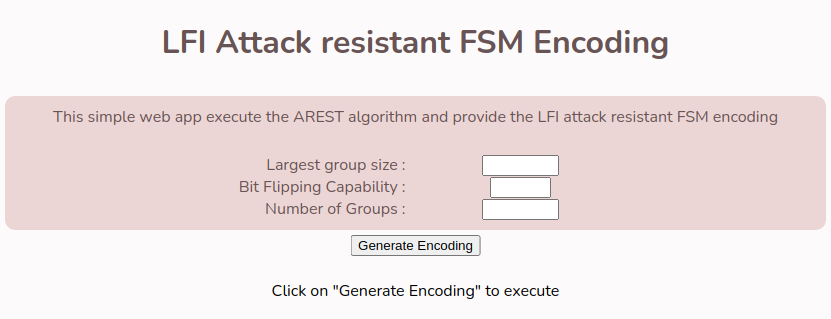

# LFI Attack resistant FSM Encoding
=================================

Simple Greedy algorithm AREST which can find you best state encoding for a given FSM data that is resistant against Laser Fault Injection attacks.

``This work has been accepted in The 40th IEEE International Conference on Computer Design ``

### Try running it on Browser

